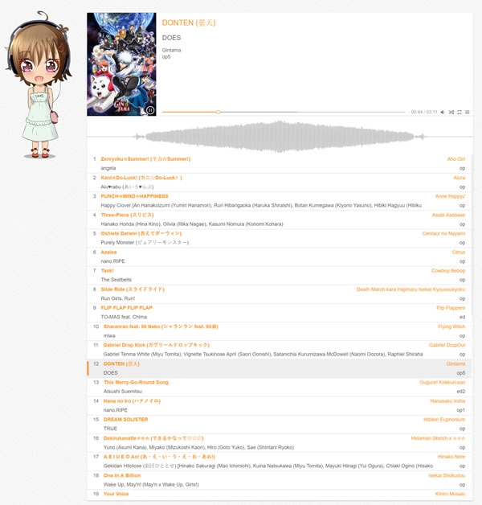

```Still work in progress!```


[](LICENSE.md)
[](https://github.com/dotnet/core)
[](https://dev.azure.com)
[](https://hub.docker.com/r/frohikey/kumiko)

## What is Kumiko?

Kumiko is a simple web music player. Playlist is loaded at startup from the provided URL.



You have some kawaii features:
- shuffling
- spectrum analyzer
- and of course playing some music!

## Playlist format

Yaml is only supported atm. 

Minimal version:

```yaml
- src: https://my.url/0.mp3
- src: https://my.url/1.mp3
```

If your mp3 files are located on the same URL as playlist you can even use shortcuts like that:

```yaml
- src: 0.mp3
- src: 1.mp3
```

Full playlist for perfectionist out there looks like this:

```yaml
- src: https://my.url/toradora-pre-parade.mp3
  title: Pre-Parade (プレパレード) 
  artist: Rie Kugimiya, Yui Horie, and Eri Kitamura
  info: Toradora!
  type: op1  
  pic: https://my.url/toragora.jpg
- src: https://my.url/toradora-silky-heart.mp3
  title: silky heart
  artist: Yui Horie
  info: Toradora!
  type: op2
  pic: https://my.url/toragora.jpg
```

## Install/Launch

Launch now. (I will provide some public playlist for testing)

```cmd
docker run -p 2000:80 -e playlist=https://my.url/anime.yaml frohikey/kumiko
```

If you do not want a public access to your running site you can use built-in basic http auth like that:

```cmd
docker run -p 2000:80 -e playlist=https://my.url/anime.yaml -e username=itsme -e password=notyou frohikey/kumiko
```

```! Since playback is directly  made from website in JS, depending on your source you may need to configure CORS```


## Acknowledgements

- Kumiko character - Chibi Headphones by [PinkTails](https://www.deviantart.com/pinktails)
- Forked Player from [VUE Aplayer](https://github.com/SevenOutman/vue-aplayer) by [Shenghao "Doma" Lei](https://seven.ooo/)
- Logo based on vector graphics by [vector_corp](https://www.freepik.com/free-photos-vectors/background)